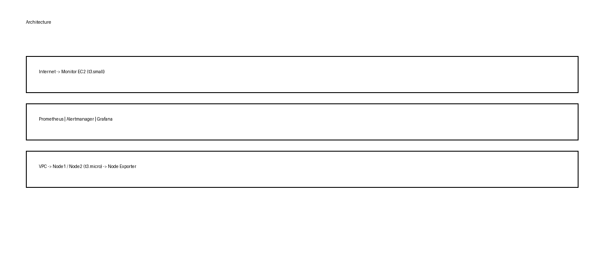

# AWS Infrastructure Monitoring Automation


[](https://www.terraform.io/)
[](https://aws.amazon.com/)
[](https://prometheus.io/)
[](https://grafana.com/)

Terraform을 활용하여 AWS 인프라와 모니터링 환경을 자동 구축한 프로젝트입니다.

Prometheus와 Node Exporter를 통해 EC2의 CPU, Memory, Disk 사용률 및 Node 상태를 수집하고, 임계값 초과 시 Alertmanager를 통해 Gmail 알림을 전송합니다. Grafana Data Source와 Dashboard도 Provisioning 방식으로 자동 구성합니다.

> **Note:** Demo 및 일부 이미지는 현재 레이아웃 확인용 mock data입니다. 실제 배포 검증 자료로 교체할 예정입니다.

<br>

## 목차

- [Demo](#demo)
- [Architecture](#architecture)
- [Features](#features)
- [Tech Stack](#tech-stack)
- [Project Structure](#project-structure)
- [Infrastructure Resources](#infrastructure-resources)
- [Terraform Variables](#terraform-variables)
- [Deployment](#deployment)
- [EC2 Bootstrap Automation](#ec2-bootstrap-automation)
- [Monitoring Flow](#monitoring-flow)
- [Monitoring Metrics](#monitoring-metrics)
- [Prometheus Target Configuration](#prometheus-target-configuration)
- [Alert Rules](#alert-rules)
- [Grafana Provisioning](#grafana-provisioning)
- [Alert Notification](#alert-notification)
- [Alert Test](#alert-test)
- [Troubleshooting](#troubleshooting)
- [Security Notes](#security-notes)

<br>

## Demo


**Resource Load → Metric Collection → Alert Firing → Email Notification → Recovery → Resolved**


<br>

## Architecture



Monitor EC2에서 Prometheus, Alertmanager, Grafana를 실행하고 동일 VPC의 Node EC2에 설치된 Node Exporter를 Private IP 기반으로 Scrape합니다.

<br>

## Features

- Terraform 기반 AWS 네트워크 및 EC2 자동 구축
- Node Exporter 자동 설치 및 systemd 서비스 구성
- Prometheus Target 및 Alert Rule 자동 구성
- CPU / Memory / Disk / Node 상태 모니터링
- Alertmanager Gmail Firing / Resolved 알림
- Grafana Prometheus Data Source 자동 Provisioning
- Grafana Dashboard 자동 Provisioning
- `node` label 기반 Node 식별
- EC2 User Data 기반 초기 설치 자동화

<br>

## Tech Stack

| Category | Technology |
|---|---|
| Cloud | AWS EC2, VPC |
| IaC | Terraform |
| Metrics | Prometheus |
| Exporter | Node Exporter |
| Alerting | Alertmanager |
| Visualization | Grafana |
| Notification | Gmail SMTP |
| Automation | Bash |
| Service Management | systemd |

<br>

## Project Structure

```text
.
├── configs
│   ├── alertmanager.yml.tftpl
│   ├── alerts
│   │   ├── cpu.yml.tftpl
│   │   ├── disk.yml.tftpl
│   │   ├── memory.yml.tftpl
│   │   └── node.yml.tftpl
│   ├── grafana
│   │   ├── dashboard.yml
│   │   ├── datasource.yml
│   │   └── monitoring-dashboard.json
│   └── prometheus.yml.tftpl
├── scripts
│   ├── install_alertmanager.sh.tftpl
│   ├── install_grafana.sh.tftpl
│   ├── install_prometheus.sh.tftpl
│   ├── monitor.sh.tftpl
│   └── node.sh.tftpl
├── systemd
│   ├── alertmanager.service
│   ├── node_exporter.service
│   └── prometheus.service
├── data.tf
├── ec2.tf
├── network.tf
├── output.tf
├── provider.tf
├── sg.tf
└── variables.tf
```

<br>

## Infrastructure Resources

| AWS Resource | Configuration | Purpose |
|---|---|---|
| VPC | Custom VPC | Monitoring infrastructure network |
| Public Subnet | 1 | EC2 deployment |
| Internet Gateway | 1 | Internet connectivity |
| Route Table | Public Route Table | Public subnet routing |
| Monitor EC2 | `t3.small` | Prometheus, Alertmanager, Grafana |
| Node 1 EC2 | `t3.micro` | Monitoring target |
| Node 2 EC2 | `t3.micro` | Monitoring target |
| Monitor Security Group | Custom SG | Monitoring service access control |
| Node Security Group | Custom SG | Node Exporter access control |

<br>

## Terraform Variables

Terraform 입력 값은 `variables.tf`에서 선언합니다.

| Variable | Type | Sensitive | Purpose |
|---|---|---|---|
| `my_ip` | `string` | No | SSH 및 Monitoring UI 접근을 허용할 Public IP CIDR |
| `region` | `string` | No | AWS Region |
| `key_name` | `string` | No | EC2 SSH Key Pair 이름 |
| `smtp_email` | `string` | Yes | Gmail SMTP 발신 및 인증 계정 |
| `smtp_password` | `string` | Yes | Gmail SMTP App Password |

```hcl
variable "my_ip" {
  description = "My public IP address"
  type        = string
}

variable "region" {
  description = "AWS Region"
  type        = string
}

variable "key_name" {
  description = "My key pair ID"
  type        = string
}

variable "smtp_email" {
  type      = string
  sensitive = true
}

variable "smtp_password" {
  type      = string
  sensitive = true
}
```

`monitor_sg`의 SSH, Grafana, Prometheus, Alertmanager 포트는 `var.my_ip`로 제한하고, Node Exporter `9100` 포트는 VPC CIDR인 `10.0.0.0/16` 내부에서만 접근할 수 있도록 구성했습니다.

<br>

## Deployment

```bash
terraform init
terraform fmt
terraform validate
terraform plan
terraform apply
```

Infrastructure removal:

```bash
terraform destroy
```

<br>

## EC2 Bootstrap Automation

Monitor EC2는 `templatefile()`을 이용하여 Prometheus, Grafana, Alertmanager 설치 스크립트와 설정 파일을 조합합니다. Node EC2 두 대는 공통 `node.sh.tftpl`을 사용하여 Node Exporter와 systemd service를 구성합니다.

Monitor 인스턴스는 `t3.small`, Monitoring Target은 각각 `t3.micro`를 사용합니다. Prometheus Target에는 Terraform이 생성한 `aws_instance.node1.private_ip`와 `aws_instance.node2.private_ip`를 전달하므로 재배포 후 Private IP가 변경되어도 설정 파일이 자동 생성됩니다.

<br>

## Monitoring Flow

```text
Node Exporter
      ↓
  Prometheus
      ↓
  Alert Rules
      ↓
 Alertmanager
      ↓
  Gmail SMTP
```

<br>

## Monitoring Metrics

| Metric | Alert Condition | Duration |
|---|---|---|
| CPU Usage | CPU Usage > 80% | 30 seconds |
| Memory Usage | Memory Usage > 90% | 30 seconds |
| Disk Usage | Root Filesystem Usage > 80% | 30 seconds |
| Node Status | Node Exporter Unreachable | 30 seconds |

<br>

## Prometheus Target Configuration

`instance` label은 실제 Scrape Endpoint 식별에 유지하고, Grafana와 Alert Message에는 사람이 읽기 쉬운 `node` label을 사용합니다.

```yaml
static_configs:
  - targets:
      - "<node1-private-ip>:9100"
    labels:
      node: "node1"

  - targets:
      - "<node2-private-ip>:9100"
    labels:
      node: "node2"
```

<br>

## Alert Rules

### CPU Usage

```promql
100 - (
  avg by(instance, node) (
    rate(node_cpu_seconds_total{mode="idle"}[2m])
  ) * 100
) > 80
```

CPU Core별 시계열을 `avg by(instance, node)`로 Node 단위 집계합니다.

### Memory Usage

```promql
(
  1 -
  (
    node_memory_MemAvailable_bytes
    /
    node_memory_MemTotal_bytes
  )
) * 100 > 90
```

### Disk Usage

```promql
100 * (
  1 -
  (
    node_filesystem_avail_bytes{
      mountpoint="/",
      fstype!~"^(fuse.*|tmpfs|cifs|nfs)"
    }
    /
    node_filesystem_size_bytes{
      mountpoint="/",
      fstype!~"^(fuse.*|tmpfs|cifs|nfs)"
    }
  )
) > 80
and on(instance, device, mountpoint)
node_filesystem_readonly == 0
```

### Node Status

```promql
up{job="node"} == 0
```

<br>

## Grafana Provisioning

Prometheus Data Source는 고정 UID `prometheus`를 사용합니다.

```yaml
apiVersion: 1

datasources:
  - name: prometheus
    type: prometheus
    uid: prometheus
    access: proxy
    url: http://localhost:9090
    isDefault: true
    editable: false
```

Dashboard JSON은 gzip 압축 후 Base64 인코딩하여 EC2 User Data에 전달합니다.

```hcl
grafana_dashboard = base64gzip(
  file("${path.module}/configs/grafana/monitoring-dashboard.json")
)
```

```bash
printf '%s' '${grafana_dashboard}' \
  | base64 --decode \
  | gzip --decompress \
  > /var/lib/grafana/dashboards/monitoring-dashboard.json
```

<br>

## Alert Notification

Alertmanager는 Gmail SMTP를 사용합니다. Alert 발생 시 Firing 메일을 전송하고 정상 복구 시 Resolved 메일을 전송합니다. SMTP Email과 App Password는 Terraform Variable을 통해 Template에 전달합니다.

<br>

## Alert Test

| Case | Command |
|---|---|
| CPU | `yes > /dev/null &` (반복 실행) |
| Recovery | `kill $(jobs -p)` |
| Memory | `python3 -c "a=bytearray(800*1024*1024); input()"` |
| Disk | `sudo fallocate -l 5G /test.img` → `sudo rm -f /test.img` |
| Node Down | `sudo systemctl stop node_exporter` → `sudo systemctl start node_exporter` |

<details>
<summary>전체 명령어 보기</summary>

**CPU:**
```bash
yes > /dev/null &
yes > /dev/null &
```

**Recovery:**
```bash
kill $(jobs -p)
```

**Memory:**
```bash
python3 -c "a=bytearray(800*1024*1024); input()"
```

**Disk:**
```bash
sudo fallocate -l 5G /test.img
sudo rm -f /test.img
```

**NodeDown:**
```bash
sudo systemctl stop node_exporter
sudo systemctl start node_exporter
```

</details>

<br>

## Troubleshooting

### EC2 User Data Size Limit

Grafana Dashboard JSON을 User Data에 직접 포함하면서 크기 제한을 초과했습니다. JSON을 gzip 압축하고 Base64 인코딩한 뒤 EC2에서 복원하도록 변경했습니다.

### Grafana Dashboard No Data

Export된 Dashboard JSON의 기존 Data Source 참조 때문에 새 환경에서 Panel이 Data Source를 찾지 못했습니다. Prometheus Data Source UID와 Dashboard 참조를 `prometheus`로 고정하여 해결했습니다.

### Prometheus YAML Parsing Error

Prometheus Target에 `node` label을 추가하는 과정에서 YAML indentation 오류로 서비스가 시작되지 않았습니다.

```bash
promtool check config /etc/prometheus/prometheus.yml
```

`promtool`로 오류 Line을 확인하고 `static_configs`, `targets`, `labels` 구조를 수정했습니다.

<br>

## Security Notes

```gitignore
.terraform/
*.tfstate
*.tfstate.*
*.tfvars
*.pem
```

Terraform State, SMTP App Password, SSH Private Key 등 민감 정보는 공개 Repository에 커밋하지 않습니다.
